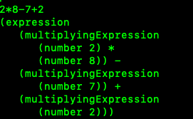

# Parsing-Project

---

## Setup:
**1.) Installing antlr4 on Mac**
https://www.antlr.org/
```
OS X
$ cd /usr/local/lib
$ sudo curl -O https://www.antlr.org/download/antlr-4.9.2-complete.jar
$ export CLASSPATH=".:/usr/local/lib/antlr-4.9.2-complete.jar:$CLASSPATH"
$ alias antlr4='java -jar /usr/local/lib/antlr-4.9.2-complete.jar'
$ alias grun='java org.antlr.v4.gui.TestRig'
```

---

**2.) Get local copy**

Next, clone down the repository to your local machine
```
git clone https://github.com/mbb5ym/Parsing-Project.git
```

---

**3.) Run commands**
```
antlr4 -Dlanguage=Python3 parsingProject.g4
```
This will generate the parser, lexer, and listener

To check if everything is set up properly run:
```
Python parsingProject.py < test.txt
```
if your terminal says "Parsed expression 2*8-7+2 has value 11" 
then run:
```
pygrun parsingProject expression -t
```
type: 2*8-7+2 and then control-D twice (on mac) and it should display this text



you're all set up now

---

**4.) Possible Errors**
```
ImportError: No module named antlr4
```
fix by installing antlr4 runtime with this command:
```
pip install antlr4-python3-runtime
```
If you are having issues with commands with '... python ...', change it to '... python3 ...'

